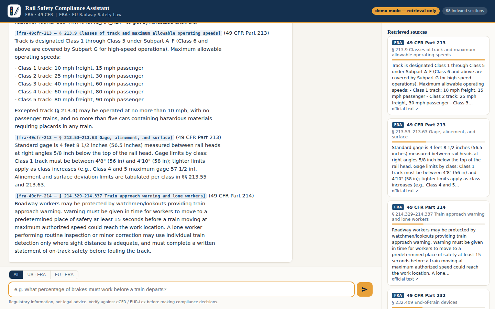
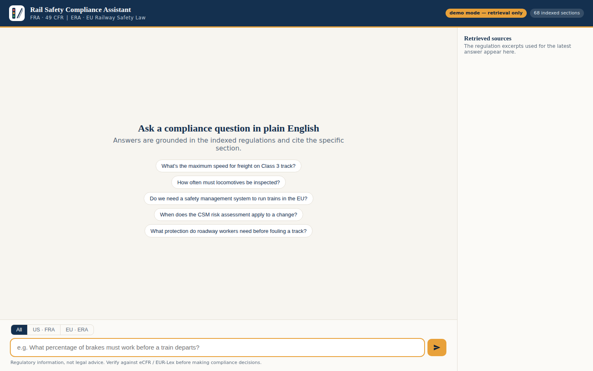

# Rail Safety Chatbot

A retrieval-augmented (RAG) chatbot for asking **plain-English compliance
questions** about rail safety regulations:

- **US — FRA**: Title 49 CFR (track safety, workplace safety, operating
  rules, drug & alcohol, locomotive and brake standards, crew certification)
- **EU — ERA**: the Railway Safety Directive (EU) 2016/798, CSM-RA
  402/2013, CSM-SMS 2018/762, and TSI OPE 2019/773

Ask things like *"What's the maximum speed on Class 3 track?"*, *"How often
do locomotives need inspection?"*, or *"Do we need a safety management
system to run freight trains in the EU?"* and get a grounded answer with
inline citations to the specific regulation section.



## How it works

```
question ──► BM25 retrieval over chunked regulation docs ──► top-k excerpts
                                                                  │
answer with [doc § section] citations ◄── Claude (Opus 4.8) ◄─────┘
```

- **Corpus** (`data/corpus/*.md`): curated summaries of the key FRA parts
  and ERA instruments, one markdown file per regulation, split into chunks
  on section headings at index time. These are *condensed summaries for
  retrieval*, not official legal text.
- **Retrieval** (`railsafe/retriever.py`): BM25 (lexical) with light
  domain-synonym query expansion — no embedding API or vector database
  required, and section numbers like `213.9` are matched exactly.
- **Generation** (`railsafe/chat.py`): Claude Opus 4.8 with adaptive
  thinking and streaming. The model is instructed to answer **only** from
  the retrieved excerpts, cite each claim inline, keep the US and EU
  regimes separate, and say when the corpus doesn't cover a question.
  The system prompt and conversation prefix carry prompt-caching
  breakpoints so multi-turn sessions reuse cached context.

## Quick start

```bash
pip install -e ".[dev]"

# 1. Build the retrieval index
python -m railsafe.ingest

# 2. Chat (needs ANTHROPIC_API_KEY, or an `ant auth login` profile)
export ANTHROPIC_API_KEY=sk-ant-...
python -m railsafe.chat
```

```
you> what is the maximum speed for freight on class 4 track?
On Class 4 track, the maximum allowable operating speed for freight trains
is 60 mph (80 mph for passenger trains) [fra-49cfr-213 § 213.9]. ...
```

### Web UI

```bash
uvicorn railsafe.server:app --reload
# open http://127.0.0.1:8000
```

A single-page chat interface (vanilla JS, no build step) backed by a FastAPI
server that streams answers over Server-Sent Events. Each answer starts with
a `sources` event, so the right-hand panel shows exactly which regulation
excerpts the answer is grounded in — jurisdiction badges, relevance bars,
and links to the official text. A segmented control restricts retrieval to
the US or EU regime.

Without an API key the server runs in **demo mode**: retrieval works and the
top excerpts are streamed back verbatim, so the UI is fully demoable
offline.



### CLI

One-shot mode:

```bash
python -m railsafe.chat --ask "When does the CSM risk assessment apply to a signalling change?"
```

Useful flags:

| Flag | Effect |
|---|---|
| `--jurisdiction US-FRA` / `EU-ERA` | restrict retrieval to one regime |
| `--k 8` | number of excerpts retrieved per question |
| `--retrieve-only` | inspect retrieval results without calling the model (no API key needed) |
| `--model` | override the Claude model (default `claude-opus-4-8`) |

## Upgrading to official full text

The bundled corpus is a condensed summary set so the project works out of
the box. To index the **official, current eCFR text** of the FRA parts:

```bash
python -m railsafe.fetch_ecfr          # default parts: 213 214 217 218 219 229 232 240 242
python -m railsafe.fetch_ecfr 236 238  # or specific parts
python -m railsafe.ingest              # rebuild the index
```

Fetched documents land in `data/corpus/fetched/` and are indexed alongside
(or instead of — just delete the summaries) the bundled docs. For EU texts,
download the consolidated versions from EUR-Lex and drop them into
`data/corpus/` as markdown with the same front-matter header (`id`, `title`,
`jurisdiction: EU-ERA`, `citation`, `source_url`); anything under
`data/corpus/` is picked up by the ingester.

## Tests

```bash
pytest
```

Tests cover chunking and retrieval quality (each canned compliance question
must surface the correct regulation in the top 5) and run fully offline.

## Project layout

```
data/corpus/          regulation documents (markdown + front matter)
data/index/           chunks.jsonl produced by `railsafe.ingest` (gitignored)
src/railsafe/
  chunker.py          front-matter parsing + section-based chunking
  ingest.py           corpus -> chunks.jsonl
  retriever.py        BM25 search with jurisdiction filter
  chat.py             CLI chatbot (streaming, citations, prompt caching)
  server.py           FastAPI backend (SSE streaming, demo mode)
  static/             web chat UI (vanilla HTML/CSS/JS)
  fetch_ecfr.py       pull official 49 CFR text from the eCFR API
tests/
docs/                 UI screenshots
```

## Disclaimer

This tool provides regulatory information for convenience, **not legal
advice**. The corpus contains condensed summaries; always verify
requirements against the official sources (eCFR for 49 CFR, EUR-Lex for EU
law) before making compliance decisions.
